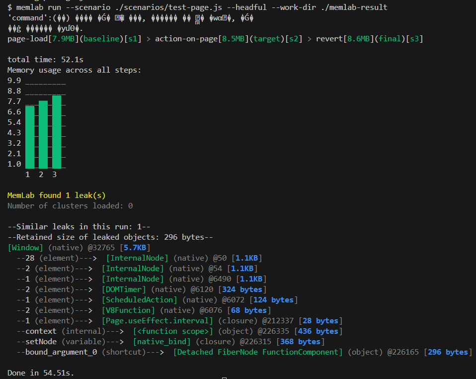
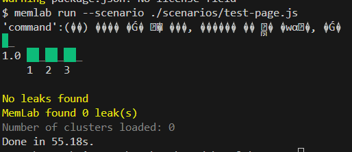

# MemLab Memory Leak Detection Example

## Overview

MemLab은 Meta에서 개발한 JavaScript 메모리 누수 감지를 위한 테스트 프레임워크입니다. 이 도구는 웹 애플리케이션에서의 메모리 누수를 자동으로 감지하고 분석하는 데 도움을 줍니다.

### 주요 기능

- **자동화된 메모리 누수 감지**: 페이지 전환 및 사용자 인터랙션에서 발생하는 메모리 누수를 자동으로 감지
- **힙 스냅샷 분석**: 메모리 사용량의 변화를 정밀하게 추적하고 분석
- **리테이너 체인 추적**: 메모리 누수의 원인이 되는 객체 참조 체인을 시각화
- **프레임워크 최적화**: React와 같은 프레임워크에 특화된 메모리 누수 패턴 감지

### 사용 시나리오

- SPA(Single Page Application)의 페이지 전환 시 메모리 누수 검사
- 컴포넌트 마운트/언마운트 시 메모리 정리 확인
- 이벤트 리스너, 타이머 등 리소스 정리 검증

## 테스트 프로젝트 실행

### Next.js 프로젝트 실행

```bash
cd nextjs
yarn
yarn dev
```

### 새 터미널에서 MemLab 테스트 실행

```bash
yarn
yarn test:memory
```

## 테스트 코드

### MemLab 시나리오 Example

```javascript
// scenarios/test-page.js
function url() {
  return "http://localhost:3000/test-base"; // 시작 페이지
}

async function action(page) {
  try {
    // 다른 페이지로 이동
    await page.waitForSelector('a[href="/test"]');
    await page.click('a[href="/test"]');
    await page.waitForNavigation({ waitUntil: "networkidle0" });
  } catch (error) {
    console.error("Action failed:", error);
  }
}

async function back(page) {
  try {
    // 이전 페이지로 돌아가기
    await page.goBack();
    await page.waitForNavigation({ waitUntil: "networkidle0" });
  } catch (error) {
    console.error("Back navigation failed:", error);
  }
}

module.exports = { url, action, back };
```

### Test 샘플

```typescript
export default function Page() {
  const [currentNode, setNode] = useState<unknown>();
  useEffect(() => {
    const handleResize = () => console.log("Window resized");

    window.addEventListener("resize", handleResize);

    // Cleanup 누락
  }, []);

  useEffect(() => {
    const div = document.createElement("div");
    document.body.appendChild(div);
    setNode(div);

    // DOM 해제 누락
  }, []);

  useEffect(() => {
    const interval = setInterval(() => {
      console.log("Running...");
    }, 500);

    // Cleanup 누락
  }, []);

  return (
    <main>
      <h1>Test Page</h1>
    </main>
  );
}
```

#### 결과



### 오류 분석

```
[Window] (native) @32765 [5.7KB]
  --28 (element)--->  [InternalNode] (native) @5832 [1.1KB]
  --2 (element)--->  [InternalNode] (native) @5834 [1.1KB]
  --1 (element)--->  [InternalNode] (native) @6280 [1.1KB]
  --2 (element)--->  [DOMTimer] (native) @6008 [324 bytes]
  --1 (element)--->  [ScheduledAction] (native) @6218 [124 bytes]
  --2 (element)--->  [V8Function] (native) @6080 [68 bytes]
  --1 (element)--->  [Page.useEffect.interval] (closure) @212331 [28 bytes]
  --context (internal)--->  [<function scope>] (object) @217801 [436 bytes]
  --setNode (variable)--->  [native_bind] (closure) @217781 [368 bytes]
  --bound_argument_0 (shortcut)--->  [Detached FiberNode FunctionComponent] (object) @217537 [296 bytes]
```

1. DOM 및 타이머 관련 문제

   ```
   --2 (element)--->  [DOMTimer] (native) @6008 [324 bytes]
   --1 (element)--->  [ScheduledAction] (native) @6218 [124 bytes]
   ```

   - 정리되지 않은 타이머(예: setInterval)가 존재
   - `useEffect` 내에서 생성된 타이머가 컴포넌트 언마운트 시 정리되지 않음

2. React 컴포넌트 문제

   ```
   [Page.useEffect.interval] (closure) @212331 [28 bytes]
   ...
   [Detached FiberNode FunctionComponent] (object) @217537 [296 bytes]
   ```

   - React 컴포넌트가 분리(Detached)되었지만 메모리에서 해제되지 않음
   - useEffect에서 생성된 interval이 여전히 활성 상태

3. 클로저와 바인딩 문제

   ```
   --setNode (variable)---> [native_bind] (closure) @217781 [368 bytes]
   ```

   - setState 함수(setNode)가 여전히 참조를 유지하고 있음

### 오류 수정후

```typescript
export default function Page() {
  const [currentNode, setNode] = useState<unknown>();
  useEffect(() => {
    const handleResize = () => console.log("Window resized");

    window.addEventListener("resize", handleResize);

    return () => {
      window.removeEventListener("resize", handleResize);
    };
  }, []);

  useEffect(() => {
    const div = document.createElement("div");
    document.body.appendChild(div);
    setNode(div);

    return () => {
      document.body.removeChild(div);
      setNode(null);
    };
  }, []);

  useEffect(() => {
    const interval = setInterval(() => {
      console.log("Running...");
    }, 500);

    return () => {
      clearInterval(interval);
    };
  }, []);

  return (
    <main>
      <h1>Test Page</h1>
    </main>
  );
}
```

#### 결과



## 주의사항

- 테스트하려는 페이지가 로컬에서 실행 중이어야 합니다
- 테스트 시나리오의 URL과 실제 페이지의 경로가 일치해야 합니다
- 페이지 간 이동 시 사용하는 선택자(예: `a[href="/test"]`)가 실제 페이지에 존재해야 합니다

## 추후 프로젝트에 적용할 계획

GitHub Actions를 통해서 PR 시 test 코드 실행하는 과정에 같이 추가되면 좋을 것 같다는 생각을...

## 참고 자료

- [MemLab GitHub](https://github.com/facebook/memlab)
- [Meta Engineering Blog Post](https://engineering.fb.com/2022/09/12/open-source/memlab/)
